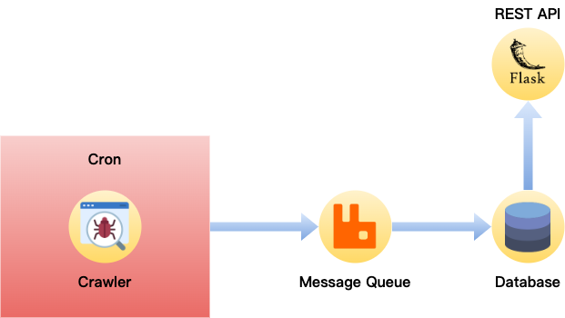

# EC-Price-Comparison

A price comparison service that simply search products displayed on a [well-known shopping website](https://www.momoshop.com.tw/), and writes it into the database through timed crawler and asynchronous message queue technology.

## How To Build

```
docker network create ec-price-comparison

docker-compose up -d
```

## How To Test API

```
curl http://localhost:9001/api/products?query=iphone
```

## Architecture



###### 標籤: `Node.js` `RabbitMQ` `Cron` `Crawler` `Python` `Flask` `SQL` `MariaDB` `Interview`
